# directx11-TUNIC
C++ DirectX 11 기반 3D 액션 어드벤처 게임 'TUNIC' 모작

<p align="center">
    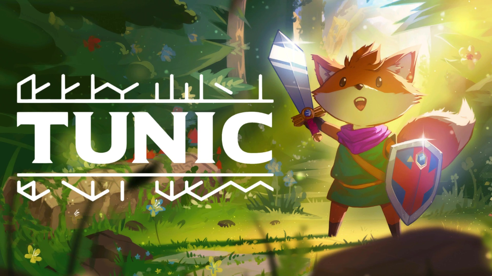
    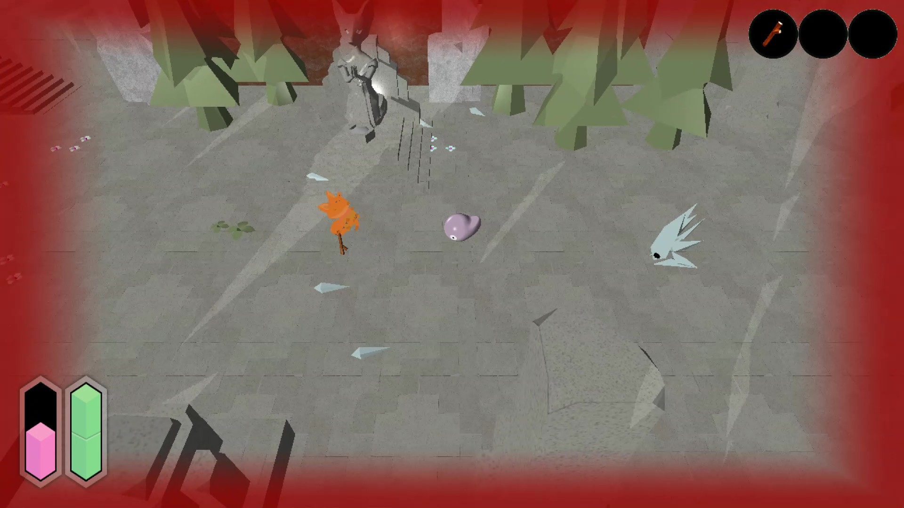<br>
    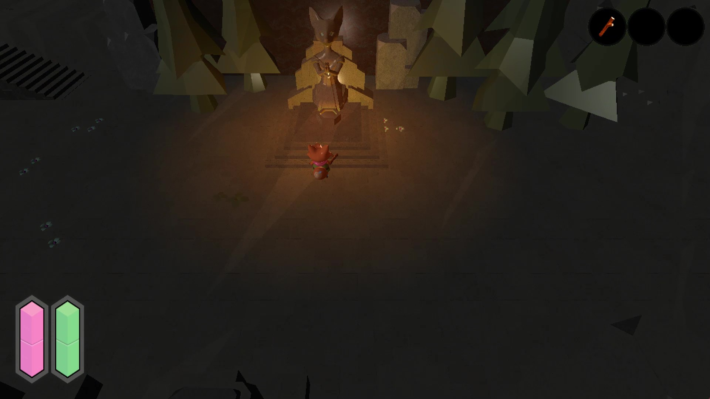
    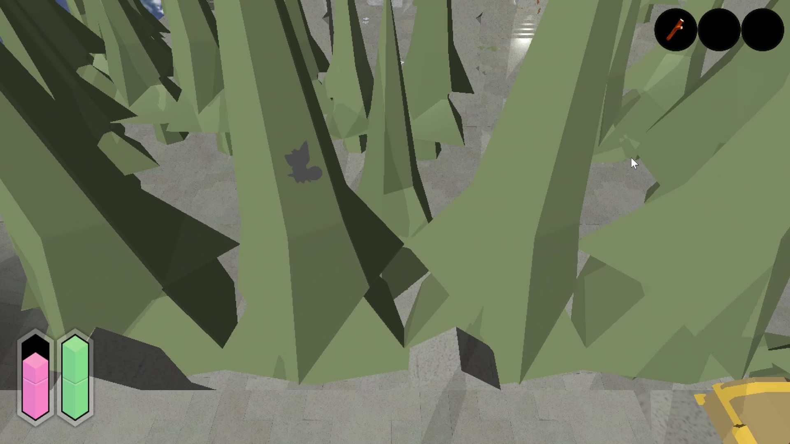<br>
    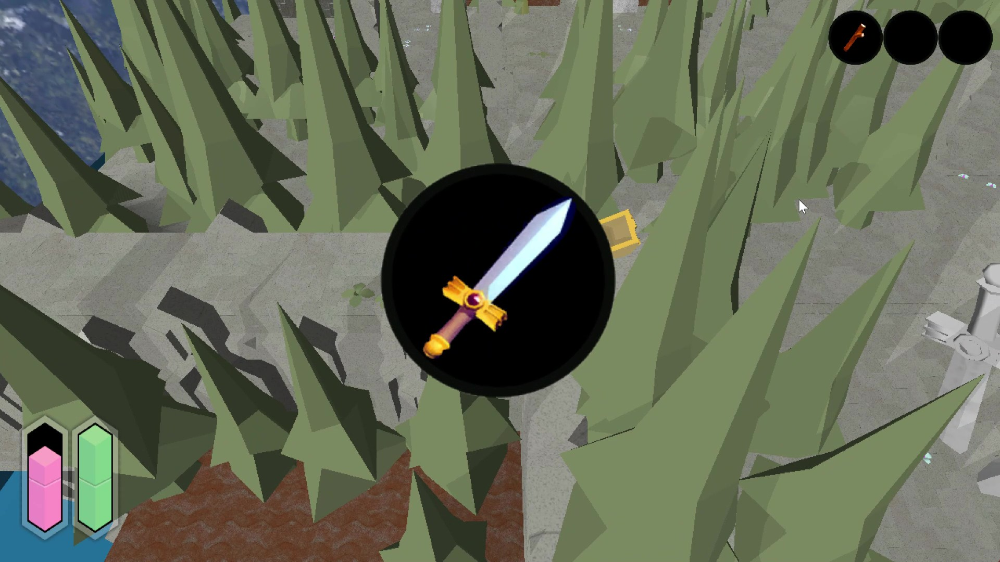
    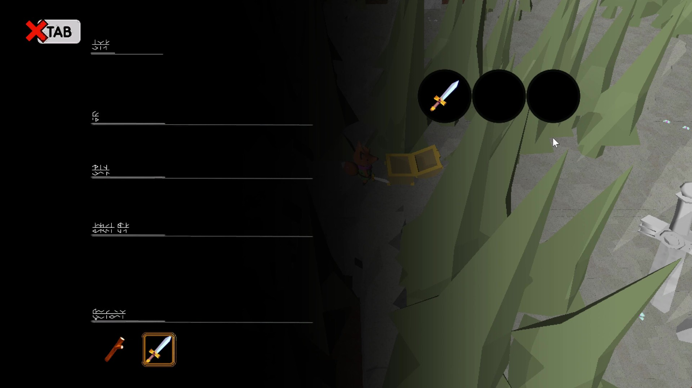<br>
    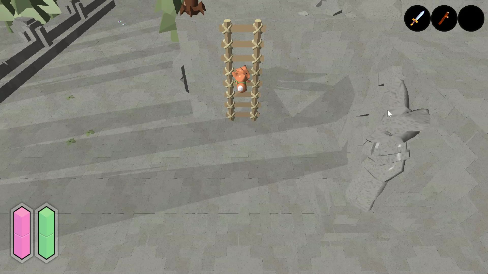
    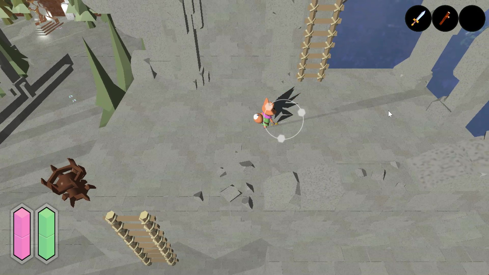<br>
    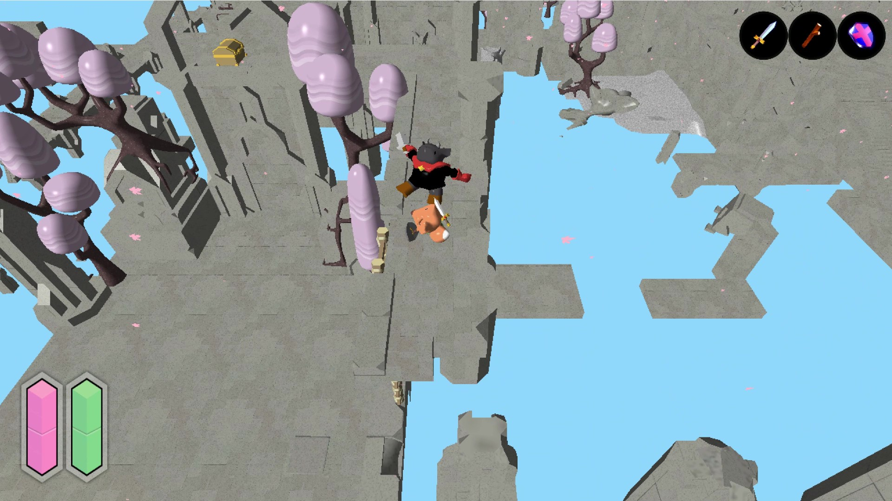
    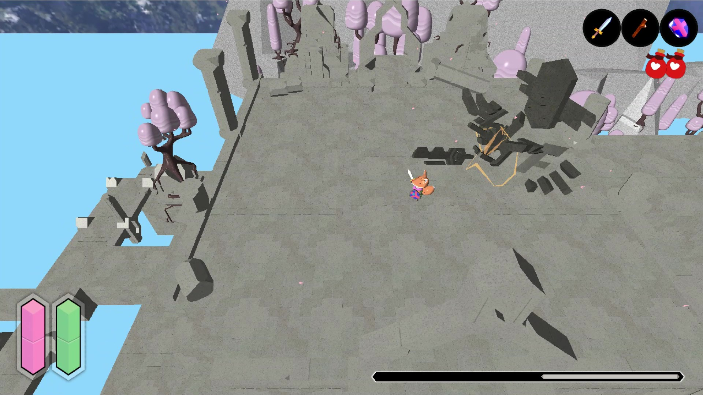

</p>

<p align="center">
    <a href="https://youtu.be/qXo6ew3sXlM">
        
    </a>
</p>

## 대표 클래스 위치
아래 토글에서 각 클래스의 **프로젝트 내 위치/역할/조각 코드/설명** 등을 볼 수 있습니다.

<details>
<summary><code>Collision</code></summary>

- **역할**
    - CCollider: AABB/OBB/Sphere 등 충돌체를 표현하는 컴포넌트
    - CCollision_Manager: 객체 간 충돌을 검사하고 충돌 이벤트를 호출하는 매니저 클래스

- **실제 프로젝트 경로**
    - Engine/Public/Collider.h
    - Engine/Private/Collider.cpp

    - Engine/Public/Collision_Manager.h
    - Engine/Private/Collision_Manager.cpp

- **소스 바로가기**
    - [Collider.h](Collision/Collider/Collider.h)
    - [Collider.cpp](Collision/Collider/Collider.cpp)

    - [Collision.h](Collision/Collision_Manager/Collision_Manager.h)
    - [Collision.cpp](Collision/Collision_Manager/Collision_Manager.cpp)

</details>

<details>
<summary><code>Climb</code></summary>

- **역할**
    - PlayerState_Climb: FSM에서 플레이어가 사다리에 탑승하는 상태 클래스

- **실제 프로젝트 경로**
    - Client/Public/PlayerState_Climb.h
    - Client/Private/PlayerState_Climb.cpp

- **소스 바로가기**
    - [PlayerState_Climb.h](Climb/PlayerState_Climb.h)
    - [PlayerState_Climb.cpp](Climb/PlayerState_Climb.cpp)

<details>
<summary>원리 설명</summary>

```cpp
// 사다리 위(LadderTop)·아래(LadderBottom) 셀에서의 탑승을 전부 고려한다
_bool bFoundTop = false;
_bool bFoundBottom = false;
```
<p align="center">
    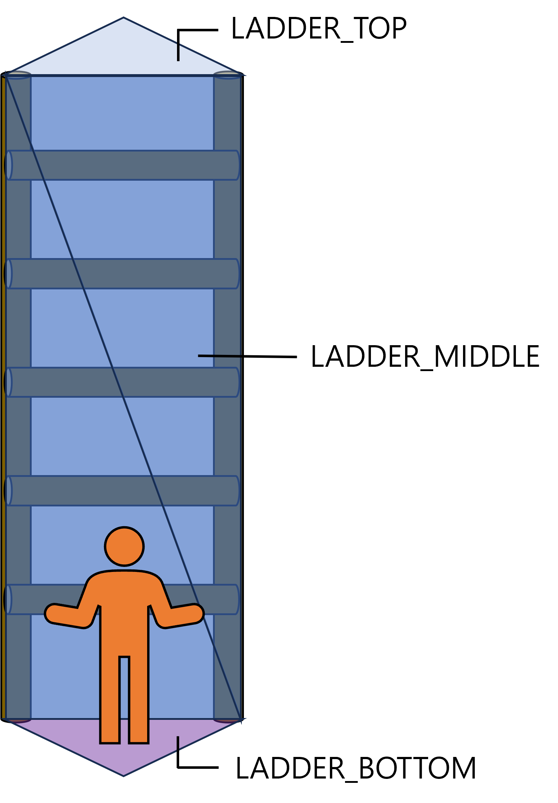
</p>
<p align="center">플레이어가 아래에서 사다리를 타는 경우</p>
<p align="center">
    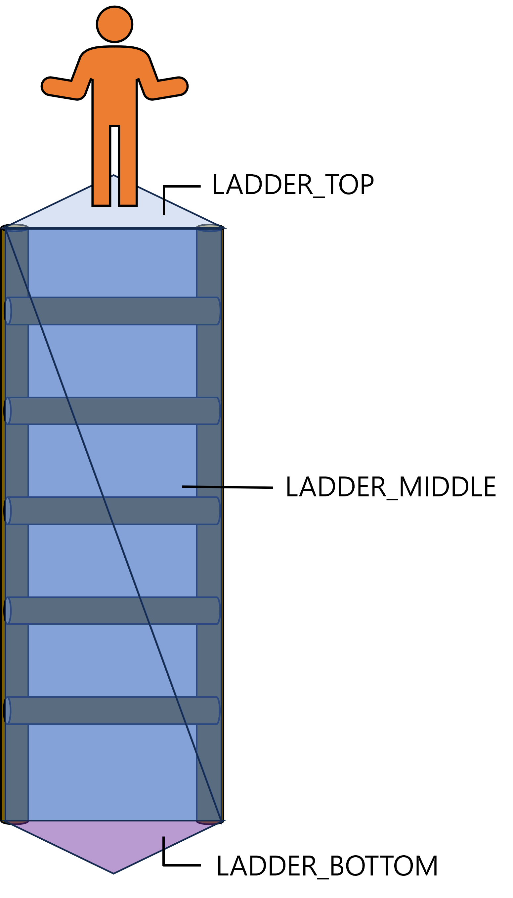
</p>
<p align="center">플레이어가 위에서 사다리를 타는 경우</p>


<p align="center">
    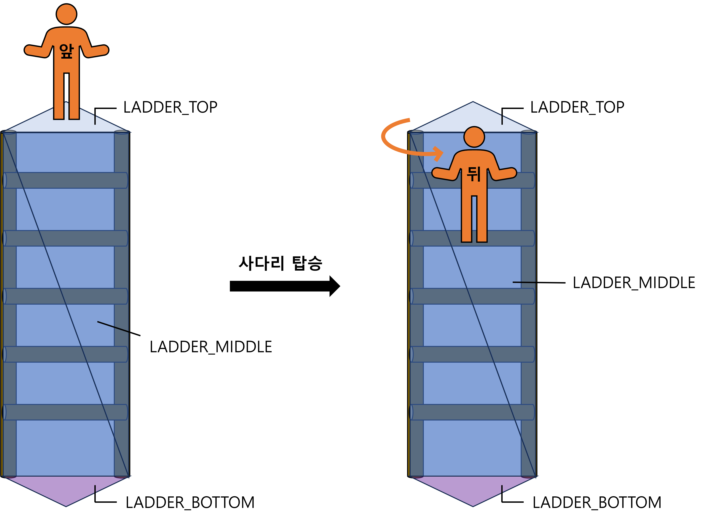
</p>
<p align="center">플레이어가 위에서 타는 경우 몸을 돌려야 함</p>

```cpp
// 사다리의 노말 벡터를 반전시켜 플레이어가 바라볼 방향을 정한다
XMStoreFloat3(&m_vClimbDir, XMVector3Normalize(XMVectorNegate(vBestMiddleNormal)));

_vector vClimbDir = XMLoadFloat3(&m_vClimbDir);

// 플레이어가 바라볼 방향에 맞춰 Right, Up, Look 벡터 갱신
_vector vUp = XMVectorSet(0.f, 1.f, 0.f, 0.f);
_vector vRight = XMVector3Normalize(XMVector3Cross(vUp, vClimbDir));
vUp = XMVector3Normalize(XMVector3Cross(vClimbDir, vRight));
```
<p align="center">
    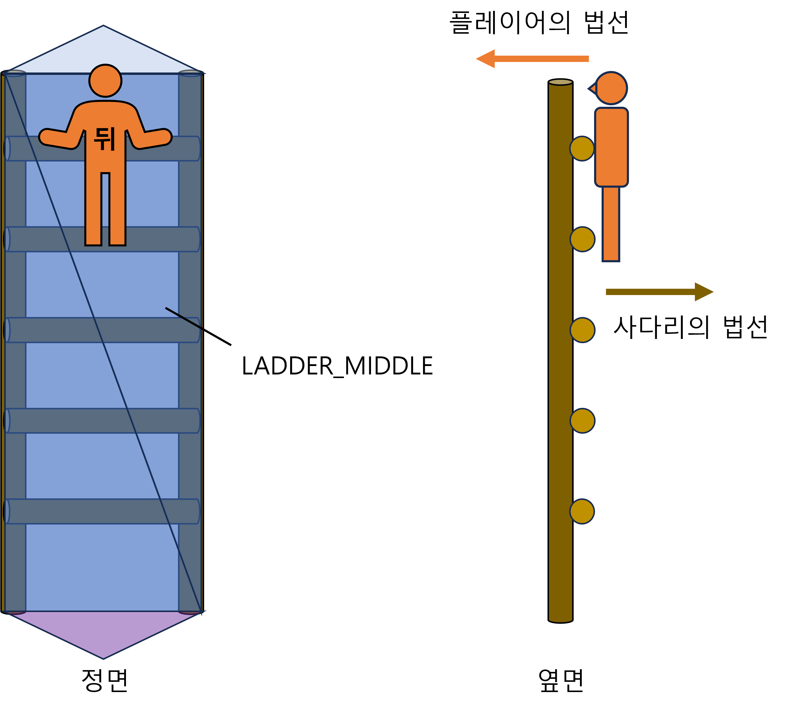
</p>
<p align="center">플레이어의 Look 벡터와 사다리의 법선 벡터가 반대</p>

</details>

<details>
<summary><code>Inventory</code></summary>

- **역할**
    - CInventory: 실제 아이템 데이터를 관리하는 컴포넌트 클래스
    - CItem: 아이템 타입/수량 등을 갖는 베이스 클래스

- **실제 프로젝트 경로**
    - Engine/Public/Inventory.h
    - Engine/Private/Inventory.cpp

    - Engine/Public/Item.h
    - Engine/Private/Item.cpp

- **소스 바로가기**
    - [Inventory.h](Inventory/Inventory/Collider.h)
    - [Inventory.cpp](Inventory/Inventory/Collider.cpp)

    - [Item.h](Inventory/Item/Item.h)
    - [Item.cpp](Inventory/Item/Item.cpp)

</details>

<details>
<summary><code>NavigationTool</code></summary>

- **역할**
    - CNavigationTool: 캐릭터의 이동을 제한하는 셀 내비게이션 제작 툴

- **실제 프로젝트 경로**
    - Tool/Public/NavigationTool.h
    - Tool/Private/NavigationTool.cpp

- **소스 바로가기**
    - [NavigationTool.h](NavigationTool/NavigationTool.h)
    - [NavigationTool.cpp](NavigationTool/NavigationTool.cpp)

</details>

<details>
<summary><code>Observer Pattern</code></summary>

- **역할**
    - Isubject: 옵저버 관리 및 태그를 통한 이벤트 콜백 함수 호출을 담당하는 클래스
    - IObserver: 콜백 인터페이스
    - CInvenUI_Background: IObserver를 상속하는 옵저버 예시 클래스

- **실제 프로젝트 경로**
    - Client/Public/Isubject.h
    - Client/Private/Isubject.cpp

    - Client/Public/IObserver.h
    - Client/Private/IObserver.cpp

    - Client/Public/InvenUI_Background.h
    - Client/Private/InvenUI_Background.cpp

- **소스 바로가기**
    - [Isubject.h](Observer/Isubject/Isubject.h)
    - [Isubject.cpp](Observer/Isubject/Isubject.cpp)

    - [IObserver.h](Observer/IObserver/IObserver.h)
    - [IObserver.cpp](Observer/IObserver/IObserver.cpp)

    - [InvenUI_Background.h](Observer/InvenUI_Background/InvenUI_Background.h)
    - [InvenUI_Background.cpp](Observer/InvenUI_Background/InvenUI_Background.cpp)

</details>

</details>